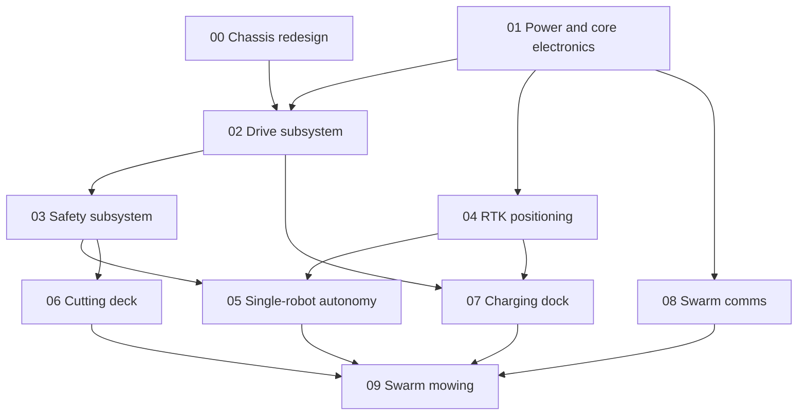

# Grass Rabbit — Build Plan

An index of iterations for the from-scratch rebuild. Each iteration ships one testable thing. Don't start the next one until the current one's exit test passes.

For the electronics list, see [hardware-bom.md](../hardware-bom.md). For where the project stands mechanically, see [project-status.md](../project-status.md).

## Iteration graph

00 and 01 run in parallel — mechanical and electrical bring-up don't depend on each other. 04, 06, 07 and 08 branch off once their prerequisites are done and don't block each other. Everything converges at 09.

## Iterations

- [00 — Chassis redesign](00-chassis-redesign.md): new modular chassis, dry-fit every part, nothing wired yet
- [01 — Power and core electronics](01-power-and-core-electronics.md): battery, BMS and ESP32-S3 alive on the bench
- [02 — Drive subsystem](02-drive-subsystem.md): motors + encoders driving in the new chassis under teleop
- [03 — Safety subsystem](03-safety-subsystem.md): bumpers, tilt cutoff, e-stop and watchdog wired into the drive loop
- [04 — RTK positioning](04-rtk-positioning.md): rover reaches RTK fixed mode against the base station
- [05 — Single-robot autonomy](05-single-robot-autonomy.md): one robot follows waypoints and holds a boundary, blades off
- [06 — Cutting deck](06-cutting-deck.md): blade motor mounted and gated by every safety interlock
- [07 — Charging dock](07-charging-dock.md): robot finds, docks and charges on its own
- [08 — Swarm comms](08-swarm-comms.md): two-plus robots talk over ESP-NOW and MQTT
- [09 — Swarm mowing](09-swarm-mowing.md): the full swarm mows a shared lawn with zone division

## Decomposing further

If a task inside an iteration file is too big to just do, break it into its own file under a matching subfolder — e.g. tasks from `02-drive-subsystem.md` that need more detail go in `02-drive-subsystem/`. Link the new file from the parent task instead of expanding the checklist in place.
