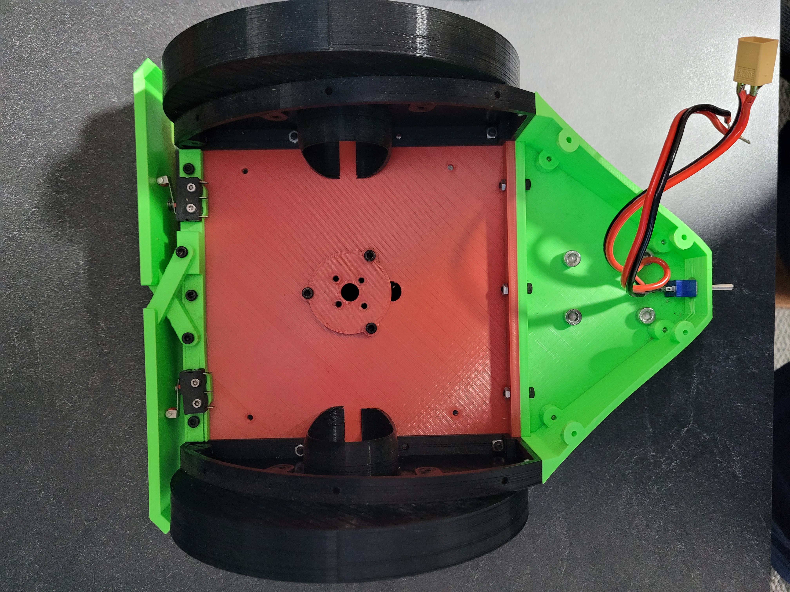
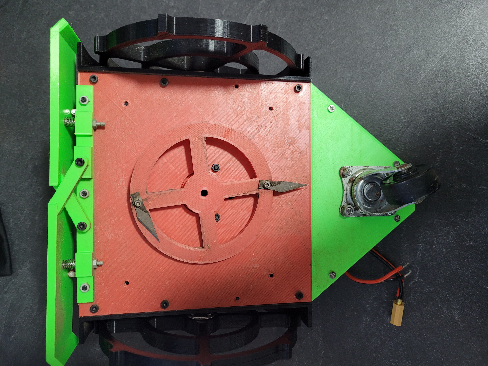
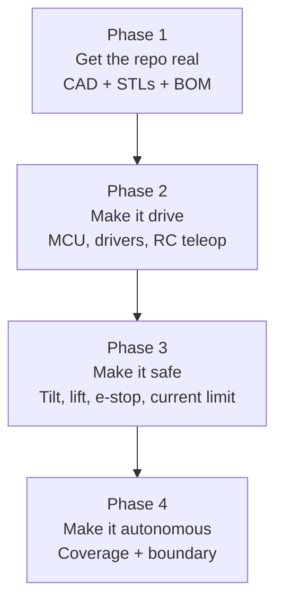

# Grass Rabbit — Where It Stands

A minimal, 3D-printed autonomous lawn mower. Right now it's a rolling chassis with a cutting deck and a bumper. No brain yet.

## What Exists Today

**Chassis.** Fully printed: a square deck plate that carries everything, a triangular nose plate, and printed side walls that hold the wheels. Bolted together with M3/M4 hardware and captive nuts.

**Drive.** Differential drive. Two large printed wheels left and right of the deck, each driven by a motor tucked inside the side wall. The wheels are spoked prints with no tire or tread — bare plastic on grass.

**Third contact point.** A salvaged metal swivel caster under the nose. It works, but it's the one non-printed, non-designed part on the robot.

**Cutting deck.** A printed rotor disc with four arms, mounted on a motor flange through the center of the deck. Three of the four razor blades are fitted, each on a single pivot bolt so it swings back on impact.

**Bumper.** A floating front bumper on a crossed-link parallelogram, spring-returned on two threaded studs. Two microswitches sit behind it, one per side, so a hit tells you roughly which side it came from.

**Power.** An XT60 pigtail, a switch, and what looks like a small regulator or trimmer near the nose. A printed battery/electronics box exists but isn't mounted or wired in.

## What's in CAD

The Fusion originals live in [legacy-models/](legacy-models/) — three designs, each as a `.f3z` source plus a `.stp` export. `Robot Mower 3` is the one that got built and the one this project is about.

**[Robot+Mower+3.f3z](legacy-models/Robot+Mower+3.f3z)** — Fusion assembly `Robot Mower 3`, version 24. Started May 2023, last saved today. Eight components, twelve solid bodies:

| Component | What it is |
|---|---|
| Base Plate | The main deck, 160 × 164.5 mm |
| Side wall ×2 | 160 × 108.6 × 25 mm, carries the drive motors |
| Front Wall / Tail Walls | The green end pieces |
| Wheel Cover ×2 | ~160 mm arc fenders |
| Wheels | Modeled, despite not being in the STEP |
| Electronics Plate | A mounting plate that isn't installed on the robot yet |
| Cutter Motor Link | Present in the tree, exports with no solid |

Two things the design does well and shouldn't be lost:

- **Hole sizes are named parameters** — `M3HoleForBolt`, `M3PassThrowHole`, `SelfTappingM3ScrewHole`, each with a comment. Retune once when the printer changes, not in forty sketches.
- **`Motor Template` is an XRef**, not a copy — a disc carrying the motor's center bore and bolt circle, shared by every mount. Edit it once and all mounts follow. It's now exported alongside the others: **Ø36.75 disc, 0.6 mm thick, Ø13 bore, 6 × Ø3 on a Ø31 bolt circle**, with the bore sitting 7.5 mm off the bolt-circle centre.

**[Robot+Mower+3.stp](legacy-models/Robot+Mower+3.stp)** — only 4 of the 8 components made it into this export. Useful for measuring, useless as a source. The dimensions above come from parsing its geometry, so they're bounding boxes rather than nominal values, and the overall envelope of 196 × 245 × 109 mm is a floor, not the real width — the wheels aren't in that file.

Still not modeled anywhere: the blade rotor, the bumper linkage and its switches, the caster mount, and the battery box. All four are built and sitting on the bench.

## What's Missing

The mechanical side is roughly 70% there. Everything else is at zero.

- **No controller.** No MCU, no motor drivers, no wiring harness, no fuse.
- **No sensors** beyond the two bumper switches. No wheel encoders, no IMU, no tilt/lift cutoff, no current sensing, no battery monitoring.
- **No software.** Not a line.
- **No safety cutoff.** A four-blade rotor with no lift or tilt sensor and no e-stop is the single biggest gap.
- **No traction.** Printed wheels will spin on damp grass and won't climb anything.
- **Nothing committed.** The CAD and photos sit in an untracked `.docs/`. No STLs, no print profiles, no BOM.

## Proposed Path

Four phases. Don't skip ahead — each one is testable on its own.

### Phase 1 — Get the repo real

Rebuilding the design as code in [model/](../model/), with the Fusion files kept as the dimensional reference. See that folder's README for how it runs and what's ported so far.

- Commit the `.f3z` files. `Motor Template` is already exported, so the XRef can't go stale.
- Model the missing parts — blade rotor, bumper linkage, caster mount, battery box — so the CAD matches the robot on the bench.
- Give `Cutter Motor Link` real geometry, or delete it from the tree.
- Export STLs per printable part and commit them next to the source.
- Write a BOM with the motors, bearings, fasteners, caster, and blade spec — part numbers, not descriptions.
- Note the print settings that matter: the wheels and rotor disc are structural and need real perimeter counts.

### Phase 2 — Make it drive

Target: RC teleop across the lawn, blades off, then blades on.

- Pick the controller. An ESP32 is the pragmatic default — Wi-Fi for telemetry and OTA, enough pins, cheap to replace when one dies in the rain.
- Two brushed drivers for the wheels (BTS7960 or similar if the motors are geared DC), plus an ESC or a separate driver for the blade motor.
- Add wheel encoders now, not later. Odometry is needed for anything autonomous, and retrofitting them to an assembled robot is painful.
- Design a real electronics tray: battery, BMS, main switch, fuse, and a dry, gasketed box.

### Phase 3 — Make it safe

The blade motor gets its own hard-disabled path — software says go, hardware gets a veto.

- Tilt and lift cutoff: an IMU for tilt, plus a lift switch or two on the chassis.
- A physical e-stop that kills blade power independently of the MCU.
- Blade motor current sensing to spot a jam or a stall.
- A watchdog that stops both drive and blade if the control loop stalls.

### Phase 4 — Make it autonomous

Start dumb and useful, then get smarter. Random-bounce coverage with a perimeter wire is the fastest thing that actually cuts a lawn. Upgrade to mapped coverage once you trust the odometry.

Boundary options, cheapest to best:
- **Perimeter wire** — proven, boring, a weekend of work.
- **RTK GNSS** — precise mapped coverage, but needs a base station and open sky.
- **Vision** — grass/not-grass segmentation. Interesting, unreliable alone.

## Open Questions

These change the design, so worth settling early:

- Which motors are in there now? Geared DC, BLDC hub, or repurposed scooter motors? It drives driver selection and encoder mounting.
- Battery chemistry and voltage — Li-ion pack with a BMS, or LiPo?
- Is 196 × 245 mm the final size, or is this a proof of concept to scale up? That sets cut width, runtime budget, and whether a docking station matters.
- Is weather sealing a goal, or does the robot live indoors between runs?
